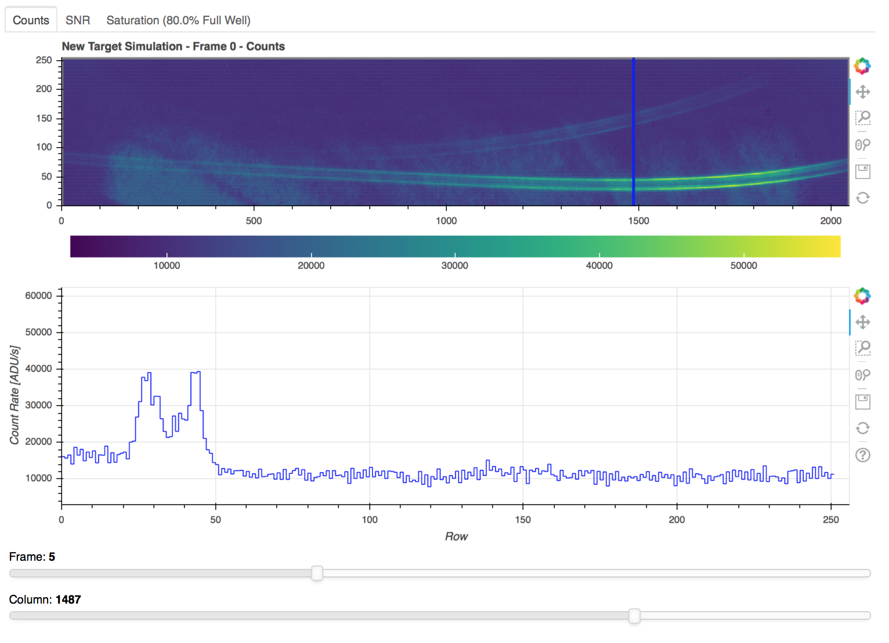

.. _soss_data:

Simulating NIRISS Single Object Slitless Spectroscopy (SOSS) data with Mirage
=============================================================================

Mirage can be used to simulate NIRISS SOSS data using the *soss_simulator.py* module. Both the CLEAR and F277W filters are supported as well as the FULL, SUBSTRIP256, and SUBSTRIP96 subarray configurations. Single point source objects as well as transiting exoplanet systems can easily be simulated.

The transiting exoplanet WASP-43b is simulated as an example in the `NIRISS SOSS example notebook <https://github.com/spacetelescope/mirage/blob/master/examples/NIRISS_SOSS_exoplanet_example.ipynb>`_.

User Inputs
-----------
As with other modes supported by Mirage, a yaml parameter file can be passed to the :class:`soss_simulator.SossSim` class.

::
    from mirage.soss_simulator import SossSim
    from hotsoss import STAR_DATA, PLANET_DATA

    # Using a YAML file
    soss256 = SossSim(paramfile='path/to/file.yaml', star=STAR_DATA)

Additionally, the simulation parameters can be passed directly to the instance as arguments and/or updated as properties.

::
    # Or using arguments
    soss256 = SossSim(nints=50, ngrps=3, subarray='SUBSTRIP256', star=STAR_DATA)
    soss256.ngrps = 5

Here :code:`STAR_DATA` is a list of the wavelength and flux density of the target star as :code:`astropy.units.quantity.Quantity` arrays.

A planet transmission spectrum and `Batman <https://www.cfa.harvard.edu/~lkreidberg/batman/>`_ transit model can also be defined to include a transiting exoplanet.

::
    # Add transmission spectrum to the simulation
    soss256.planet = PLANET_DATA

    # Create transit model with batman
    import batman
    params = batman.TransitParams()
    params.t0 = 0. # time of inferior conjunction
    params.per = 5.7214742 # orbital period (days)
    params.a = 7.92 # semi-major axis (in units of stellar radii)
    params.rp = 0.1 # radius ratio for Jupiter orbiting the Sun
    params.inc = 89.8 # orbital inclination (in degrees)
    params.ecc = 0. # eccentricity
    params.w = 90. # longitude of periastron (in degrees) p
    params.limb_dark = 'quadratic' # limb darkening profile to use
    params.u = [0.1,0.1] # limb darkening coefficients
    tmodel = batman.TransitModel(params, tso_transit.time)
    tmodel.teff = 3500 # effective temperature of the host star
    tmodel.logg = 5 # log surface gravity of the host star
    tmodel.feh = 0 # metallicity of the host star

    # Add transit model to the simulation
    soss256.tmodel = tmodel

Simulation
----------
To generate the simulation, run

::
    soss256.create()

The raw simulation is generated by scaling the 2D monochromatic PSF generated by :code:`webbpsf` to the flux given by the input stellar spectrum at the appropriate wavelength in each column for orders 1 and 2.

The data is then passed to the ramp and noise generation scripts in Mirage to create the finalized simulation.

The final product is written to file in the working directory. An interactive plot of the data can be created with the :meth:`plot` method.

::
    soss256.plot()

