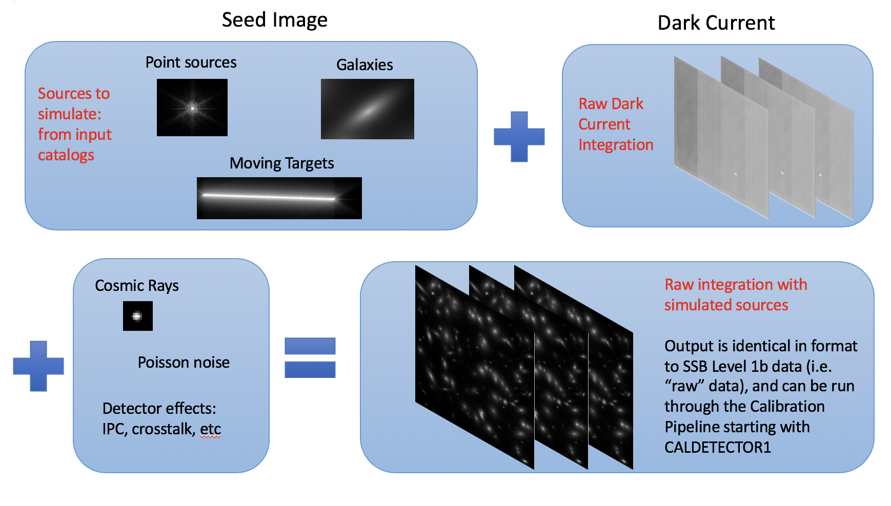
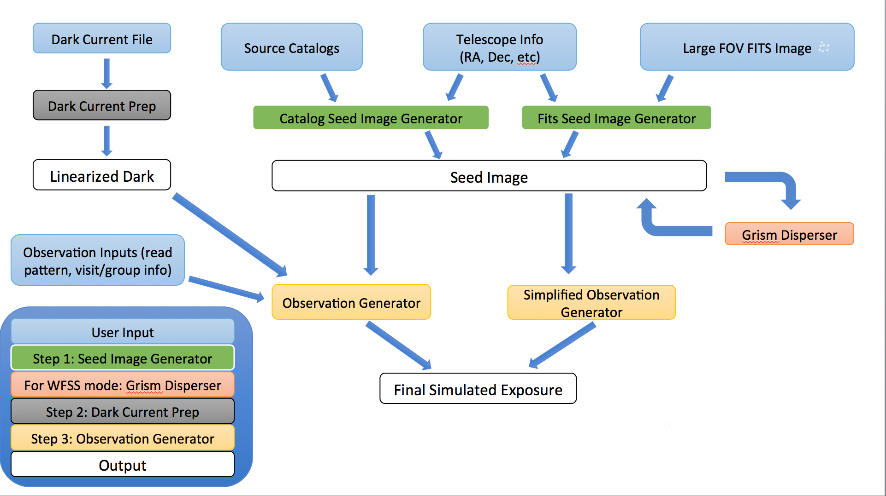

.. _stages:

Mirage's Three Stages
=====================

Mirage can be broadly divided into three stages. Mirage first creates an idealized, noiseless image of the astronomical scene. We refer to this as the "seed image". It then reorganizes an existing dark current exposure to match the characteristics of the specified simulation. The seed image and the dark current exposure are then combined.

Below is a more detailed flow chart showing Mirage's overall process for creating simulated data. Blue boxes show user inputs, and white boxes contain outputs.

Seed Images
-----------

The first stage is the creation of the :ref:`“seed image” <seed_images>`. This is a noiseless count rate image that contains signal only from the astronomical sources to be simulated. Seed images include instrument distortion effects, so that given RA, Dec values are properly converted to pixel x,y values, with the exception of tangent plane projection, which will be added soon. Mirage currently contains two methods for the construction of seed images:

1. Through the use of :ref:`source catalog files <source_catalogs>`
2. Extraction from a fits file containing a :ref:`distortion-free image <mosaic_input>` (e.g. HUDF, GOODS, CANDELS, etc)

For WFSS observations, multiple seed images or optional input spectra are then fed into the `disperser software <https://github.com/npirzkal/NIRCAM_Gsim>`_, which simulates the effects of the grism by dispersing the signal from the astronomical sources, creating a “grism seed image”.

For a detailed description of seed image creation, see the :ref:`Seed Images <seed_images>` page.

Dark Current Preparation
------------------------

The second stage is the preparation of the dark current exposure to use for the simulation. The input dark current exposure is reorganized into the requested readout pattern and number of groups and cropped to the requested subarray size. Detector non-linearity effects are then removed using the initial steps of the JWST calibration pipeline.

By using actual dark current exposures from ground testing, Mirage is able to capture many effects which are specific to the instrument and detector being simulated. For example, the 1/f noise, bias structure, and hot pixel population.

Details of the dark current preparation are given on the :ref:`Dark Preparation <dark_prep>` page.

Observation Generation
----------------------

The final stage involves the combination of the seed image and the dark current in order to produce the output exposure. The seed image is expanded into integrations with groups that follow the requested readout pattern. Other effects are also added at this stage, including cosmic rays, interpixel capacitance (IPC) and crosstalk effects.

More details are provided on the :ref:`Observation Generation <obs_generator>` page.
